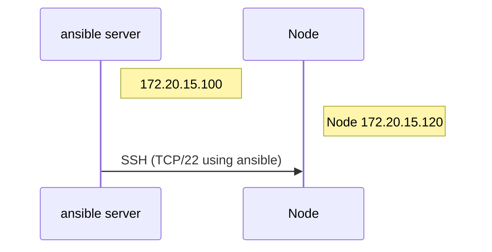

# How to deploy zabbix using ansible

## Environment 




## Clone Repository

`# cd /etc/ansible`  
`# git clone https://github.com/hatanoyoshihiko/zabbix.git`  

## Configure inventory file

If you'd like to specify your server, changed below.

- [zabbix_server]  
host group name, this parameter is used in setup.yml.

- ansible_host  
this parameter specifies your server IP Address (node).


`# cd zabbix/ansible/5.0` or `# cd zabbix/ansible/6.0`  
`# vi inventory/inventory.ini`

```ini
[zabbix_server]
zabbix01 ansible_host=172.20.55.190
```

## Configure setup file

If you'd like to specify host group, you should specify host group below.
Change "hosts:xxx" same as like inventory.ini.

`# vi setup.yml`  

```bash
hosts: ubuntu,alma,rocky
```

## Variables

- group variables(group_vars)  
this variables specifies os distribution common configuration.

- role variables(main.yml)  
this variables specifies variables by middle ware.


```bash
inventory-|
          |-group_vars-|
                       |-alma.yml, rocky.yml, ubuntu.yml
roles-----|
          |-common--|
          |         |-vars-|
          |                |-main.yml
          |-mariadb-|
          |         |-vars-|
          |         |-main.yml
          |-zabbix--|
                    |-vars-|
                           |-main.yml                                                                    
```

## Run playbook

- syntax check

`# ansible-playbook -i inventory/inventory.ini setup.yml -k --syntax-check`

- run playbook

`# ansible-playbook -i inventory/inventory.ini setup.yml -k`

## Initial zabbix setting for zabbix 5.0

Access to zabbix URL to be appeared end of playbook.

1. Welcome
Push Next step.

2. Check of pre-requisites
Push Next step.

3. Configure DB Connection
Input like below

- Database type: MySQL
- Database host: localhost
- Database port: 0
- Database name: zabbix
- User: zabbix
- Password: zabbix

4. Zabbix server details

- Host: localhost
- Port: 10051
- Name: What you want

5. Pre-installation summary

Push Next step

6. Install

If below message shows, you can access to zabbix server.  
`"Congratulations! You have successfully installed Zabbix frontend."`

## Initial zabbix setting for zabbix 6.0

Access to zabbix URL to be appeared end of playbook.

1. Welcome

- Default language  
chose your language and push Next step.

2. Check of pre-requisites

Push Next step.

3. Configure DB Connection

Input like below

- Database type: MySQL
- Database host: localhost
- Database port: 0
- Database name: zabbix
- Store credentials in: Plain text
- User: zabbix
- Password: zabbix

4. Settings

- Zabbix server name: what you want
- Default time zone: System
- Default theme: Blue

5. Pre-installation summary

Push Next step

6. Install

If below message shows, you can access to zabbix server.  
`"Congratulations! You have successfully installed Zabbix frontend."`
